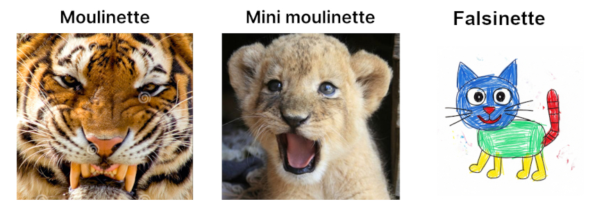

# 📦 Falsinette

La falsinette est un testeur fait maison pour les projets de 42.

> « Vulnerant Omnes molinetta Necat » vieux proverbe latin.

> « Testez! Beaucoup! Par pitié, par Odin ! Nom d’une pipe. » Le gars qui est à son 5eme retry.

Inspirée par la mini-moulinette, mais en version plus rudimentaire, plus artisanale... et parfois ~~souvent~~ plus capricieuse. L'objectif : tester des projets et essayer des trouver des bugs qui jouent au cache-cache.



> ⚠️ **Disclaimer** : le code n'est pas spécialement propre, optimisé, ni robuste. En fait, il n'est pas conçu pour être partagé 🤔 ... 🤷‍♂️. Il fait ~~parfois~~ le boulot. Les ~~bugs~~ bug-reports sont les bienvenus... tant que vous gardez en tête que tout ça a été fait ~~à l’arrache~~ avec amour.

-----

### 📥 Installation

Clonez le repo à côté de votre dossier de projet :

```arduino
.
├── falsinette/
└── push_swap/  # votre projet, par exemple
```

Comme ça :

```bash
git clone http://github.com/dariobaldi/falsinette
```

-----

### 🚀 Utilisation

1.  Placez-vous dans le dossier `falsinette` :

    ```bash
    cd falsinette
    ```

2.  Lancez un test :

    ```bash
    make push_swap
    ```

    > **Note** : remplacez `push_swap` par le nom du projet que vous voulez tester.

3.  Pour lister les projets disponibles il y a bien une commande :

    ```bash
    make help
    ```

    Cette commande affichera la liste des projets supportés et le nom exact attendu pour votre dossier de projet.


-----

### 📂 Structure attendue

Juste pour ceux comme moi qui risque d'avoir sauté ce que je viens d'écrire. Le dossier de votre projet doit avoir exactement le même nom que dans la commande `make`.

Exemple : si vous tapez `make push_swap`, votre arborescence doit ressembler à ça:

```arduino
.
├── falsinette/
└── push_swap/  # nom exact requis
```

-----

### 🛠️ Contribution

  * Les **bugs reports** sont les bienvenus.
  * Les **pull requests** avec de nouveaux tests ou des améliorations le sont aussi. J'ai jamais géré un (~~une?~~) pull request, alors soyez indulgent/e/s.

> Gardez à l'esprit : la falsinette ne vous donnera pas le dernier mot, mais elle risque d'être utile, peut-être. Bon courage dans vos projets !

-----

### 📜 Licence

Ce projet est libre d’utilisation. Faites-en ce que vous voulez. *Use at your own risk*.